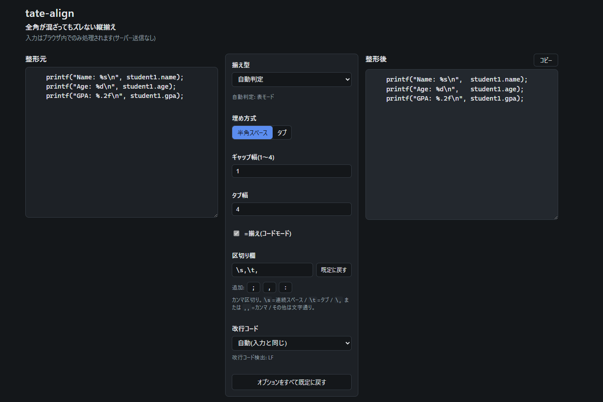
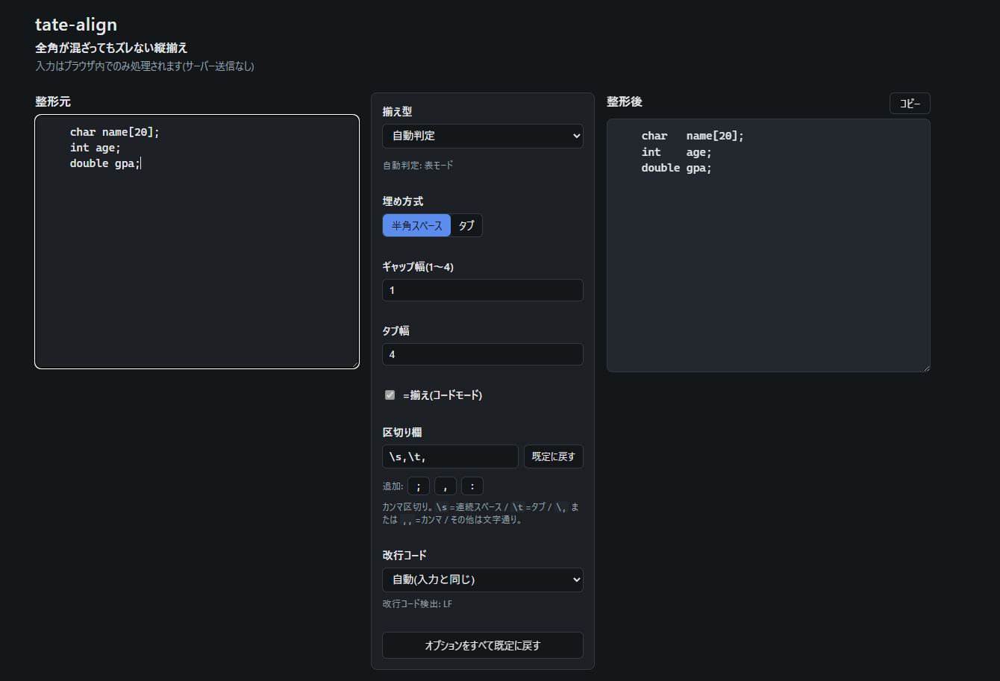

# tate-align — 全角対応・縦揃え整形ツール

**▶ 今すぐ使う: https://atoraku.github.io/tate-align/**

貼り付けたテキストの列を、**全角=2・半角=1** の表示幅(East Asian Width)を正しく計算して縦に揃えるWebツールです。ブラウザ内で完結し、入力はサーバーに一切送信しません。フレームワーク・ビルドツール・外部ライブラリ・外部フォントを一切使わない、素の HTML/CSS/JS のみで動く静的1ページです(完全オフライン動作)。

## 用途

等幅フォント環境で「縦を揃えろ」と言われる場面向けです。

- ソースコードのコメント欄・変数宣言・構造体・定数表・配列初期化
- 仕様書やメール中の簡易表
- Excel から貼り付けた表(タブ区切り)

入力は常に「どこかからのコピペ」を想定しています。

## 使い方

1. `index.html` をブラウザで開く(サーバー不要)。
2. 左の「整形元」にテキストを貼り付ける。
3. 中央のオプションで揃え方を調整する。右の「整形後」に即時反映されます。
4. 「コピー」ボタンで結果をクリップボードへ。

### 画面

左が「整形元」、中央がオプション、右が「整形後」です。入力を変えるたびに即時整形されます。



`printf` の引数を揃えた例。既定の区切り欄(`\s,\t`)のまま貼り付けるだけで、第2引数の開始桁が全行で揃います。



変数宣言を揃えた例。`char` / `int` / `double` と型名の長さが違っても、変数名の桁が揃います。

## 差別化の核

1. **全角幅計算の正確さ** — East Asian Width の Fullwidth/Wide を 2、Ambiguous(`①` `※` `±` など)も日本語等幅フォント前提で 2 として扱います。
2. **区切り欄への一本化** — 区切り文字が既定値入りの編集可能な1欄に集約されています。空白1個から任意の記号まで、自分のルールに書き換えられます。
3. **埋め方式が選べる** — 半角スペース / タブ を切り替えられます。

## 揃え型(4種)

オプション列の「揃え型」セレクトで選びます。

- **自動判定(既定)** — 行末コメント記号(`//` `#` `/*`)を持つ行が過半なら「コメント揃え」、それ以外は「表揃え」。判定結果を画面に表示します(自動判定では「全部揃え」は選ばれません)。
- **コメント揃え(コード)** — 各行を「コード部/コメント部」に分割し、行末コメント記号(`//` `#` `/*`)の桁を揃えます。オプションで `=`(代入)揃えも可能。ブロックコメント `/* ... */` は開始 `/*` と閉じ `*/` の両方を揃えます。
- **全部揃え(宣言+コメント)** — 区切り欄に従って単語列・`=` を列揃えしたうえで、コメント開始・`*/` までまとめて揃える複合モード(下の例H)。`=`揃えオプションは列分割が代替するため使いません。
- **表揃え** — 区切り欄に従って列分割し、各列の桁を揃えます。

### 例H:全部揃え(ブロックコメント)

```
int a = 0; /* 速度 */
int speed = 10; /* 加速度の設定 */
long t = 3; /* 時間 */
```

↓ 全部揃え(既定区切り `\s,\t`・スペース方式・ギャップ1)

```
int  a     = 0;  /* 速度         */
int  speed = 10; /* 加速度の設定 */
long t     = 3;  /* 時間         */
```

単語列・`=`・`/*`・`*/` がすべて同一桁に揃います。同じ入力を「コメント揃え(コード)」で処理すると、コード部はそのままで `/*` と `*/` だけが揃います。

## 区切り欄(本ツールの中心)

カンマ区切りでトークンを並べます。既定値は `\s,\t`。

| 表記 | 意味 |
| --- | --- |
| `\s` | 連続1個以上の半角スペースを1つの区切りとする(空白1個でも列が分かれる) |
| `\t` | タブ |
| `\,` | カンマそのもの |
| `,,` | カンマそのもの(`\,` と同じ。素直に打てる別表記) |
| その他 | 文字通りのトークン(複数文字可:`;` `:` `/` `//` `=>` など。全角スペースも指定可) |

- `\s` `\t` は区切り自体を除去して分割します。文字トークン(`;` など)は**左セルの末尾に残して**分割します。
- 分割後、各セルは先頭の空白をトリムしてから揃えに使います。
- 「既定に戻す」ボタンで `\s,\t` に戻せます。欄の下の `;` `,` `:` チップはワンタップで区切りを追加できます。
- 行頭がタブの行(Excel 貼り付けで先頭列が空のケース)は、区切りに `\t` が含まれるとき先頭に空セルができ、列が正しく揃います。`\t` を欄から消した場合は行頭タブはインデント扱いのままです。
- **オプションをすべて既定に戻す**ボタン(オプション列の最下部)で、モード・埋め方式・ギャップ・区切り欄などを一括で初期状態に戻せます(入力テキストは消えません)。

### 編集例

- **既定(空白1個で揃える)**: `\s,\t` — 単語ごとに列が分かれます。
- **`New York` のようにセル内に単一スペースを含む表が壊れるとき**: `\s` を消して `\t` だけにする(タブ区切りとして扱う)。
- **構造体・宣言を `;` で揃えたいとき**: `;` を足す → `\s,\t,;`。
- **配列初期化をカンマで揃えたいとき**: `,,` を足す(または `\,`)→ `\s,\t,,`。

## 埋め方式(半角スペース / タブ)

- **半角スペース(既定)** — 各セルを列の最大幅までスペース埋めし、**ギャップ幅**(1〜4、既定:コード1・表2)分のスペースを挟みます。
- **タブ** — 各列の最大幅より大きい最小のタブ幅の倍数まで、タブを挿入して揃えます(タブ幅は既定4)。ギャップ設定は無効になります。

> **タブ揃えの注意**: 貼り付け先のタブ幅がこのツールの設定と異なると見た目がずれます。貼り付け先のタブ幅に合わせてください。

## 改行コード

貼り付け時に改行コード(CRLF / LF)を自動検出し表示します。出力は「自動(入力と同じ)/ LF / CRLF」から選べます(既定:自動、検出不能時は LF)。

## 既知の限界

- 結合文字・異体字セレクタ・一部の絵文字は、環境により実際の表示幅が異なる場合があります。
- Ambiguous 文字は日本語等幅フォントを前提に幅2固定です。欧文フォント環境とは一致しないことがあります。
- 全角文字が半角2個分の幅にならないフォント(VSCode の既定フォント等)では、タブ揃え・スペース揃えとも見た目が崩れます。日本語等幅フォント(MS ゴシック・BIZ UD ゴシック等)を推奨します。
- 引用符(`'` `"` `` ` ``)の扱いは簡易走査です(ネスト・エスケープは非考慮)。

## テスト

`tests.html` をブラウザで開くと、テスト結果の一覧(N passed / M failed)が表示されます。
Node があれば次でも実行できます:

```
node -e "require('./app.js'); require('./tests.js');"
```

## v2 候補(非スコープ)

- 数値列の右揃え
- 全角スペース埋め(プロポーショナルフォント近似)
- Markdown 表整形

## ライセンス

[MIT License](LICENSE)
